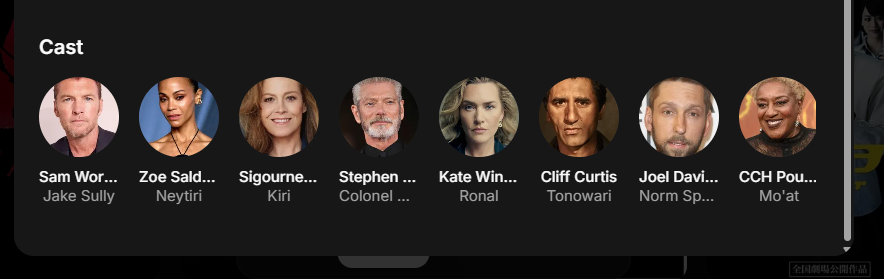
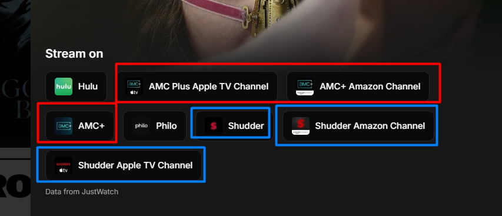
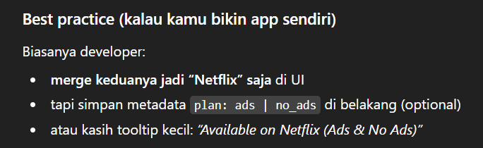

# Replay App - Improvement Plan

**Project URL:** https://project-replay.vercel.app/

## Overview
This document outlines comprehensive improvements for the Replay movie/TV discovery app. Tasks are organized by priority to ensure critical issues are addressed first, followed by UX polish and feature enhancements.

---

## Phase 1: Critical Fixes (Must Fix)

### 1.1 Mobile Horizontal Scroll Issue
**Problem:** In phone view, users need to scroll horizontally between Trending, Popular, Top Rated, Now Playing, and Filter buttons. This issue also appears on the Library tab.

**Solution:**
- Implement a dropdown/collapsible menu for category selection on mobile
- OR use a compact carousel/slider with proper touch indicators
- OR stack buttons vertically with proper spacing
- Ensure all navigation is accessible without horizontal scrolling

**Acceptance Criteria:**
- All navigation items visible without horizontal scroll on mobile screens
- Touch-friendly tap targets (minimum 44x44px)
- Smooth transitions between categories

---

### 1.2 Safe Area Handling (Mobile)
**Problem:** Edge-to-edge design doesn't seem seamless; safe area handling is not proper in phone view.

**Solution:**
- Implement proper safe area insets for iOS/Android
- Use CSS: `padding-top: env(safe-area-inset-top);`
- Use CSS: `padding-bottom: env(safe-area-inset-bottom);`
- Ensure content doesn't get cut off by notches or system UI

**Acceptance Criteria:**
- Content properly respects device safe areas
- No content hidden behind notches or system bars
- Proper padding on all edge cases (notched phones, foldables, tablets)

---

### 1.3 Streaming Service Filter Bug
**Problem:** Streaming services filter is not working on Search tab and Library tab (only works on Home/main browsing).

**Solution:**
- Debug and fix filter state management across all tabs
- Ensure filter selections persist when switching between tabs
- Verify API calls include streaming service parameters on all endpoints

**Acceptance Criteria:**
- Streaming service filter works on Home tab
- Streaming service filter works on Search tab
- Streaming service filter works on Library tab
- Filter state persists across tab navigation
- Visual feedback shows active filters on all tabs

---

## Phase 2: UX & Design Polish

### 2.1 Animation Improvements
**Problem:** Animations need to be smoother with correct easing, delay, and consistency across web and phone views.

**Solution:**
- Audit all animations (page transitions, card hovers, filter changes, etc.)
- Apply consistent easing functions:
  - Use `cubic-bezier(0.4, 0.0, 0.2, 1)` for standard easing
  - Use `cubic-bezier(0.0, 0.0, 0.2, 1)` for deceleration
  - Use `cubic-bezier(0.4, 0.0, 1, 1)` for acceleration
- Set appropriate durations (150-300ms for micro-interactions, 300-500ms for page transitions)
- Add stagger delays for list items (50-100ms increments)
- Reduce motion for users with `prefers-reduced-motion` preference

**Key Areas to Animate:**
- Card hover/tap effects
- Filter panel open/close
- Tab switching
- Content loading (skeleton screens with shimmer)
- Modal/dialog appearances
- List item entrance animations

**Acceptance Criteria:**
- All animations use consistent easing curves
- No janky or stuttering animations
- Smooth 60fps performance on mobile
- Respects user's motion preferences

---

### 2.2 Grid/List View Toggle (Mobile)
**Problem:** Mobile view only supports grid layout; need to add list view option.

**Solution:**
- Add toggle button (grid/list icons) in header near existing layout controls
- Design compact list view:
  - Show poster thumbnail (smaller)
  - Title, year, rating inline
  - Streaming service badges
  - Genre tags (optional)
- Maintain consistent spacing and touch targets
- Save user preference to localStorage

**Acceptance Criteria:**
- Toggle visible only on phone view
- Grid view displays movie posters prominently
- List view shows compact horizontal cards
- User preference persists across sessions
- Smooth transition animation between views
- Both views maintain same filtering/sorting logic

---

### 2.3 Filter Consistency Across Tabs (Mobile)
**Problem:** Filters need to be consistently available in Search and Library tabs while maintaining compact design.

**Solution:**
- Create a unified filter component that works across all tabs
- Use a bottom sheet or slide-up panel for mobile filters
- Show active filter count badge when filters are applied
- Keep filter icon in header for quick access
- Ensure filters are contextually relevant (e.g., "Watched" filter only in Library)

**Acceptance Criteria:**
- Filter UI accessible from Home, Search, and Library tabs
- Compact design doesn't overwhelm mobile screen
- Clear indication of active filters
- Follows mobile UI/UX principles (thumb-friendly zones)
- Filter state updates content immediately

---

### 2.4 Cast Name Display
**Problem:** Cast names need to show full names, but long names mess up design/layout.

**Solution:**
- Display full names by default
- For long names, implement graceful truncation:
  - Use CSS `text-overflow: ellipsis` with `overflow: hidden`
  - Set appropriate `max-width` for cast name containers
  - Add tooltip on hover/tap to show full name
- Example: "Christopher Walke..." with tooltip showing "Christopher Walken"

**Acceptance Criteria:**
- Full names displayed when space permits
- Long names truncated with ellipsis
- Tooltip shows complete name on hover (web) or tap (mobile)
- Layout remains intact with any name length
- Consistent styling across cast lists

---

### 2.5 Hide Library Toggle in Web View
**Problem:** The toggle button inside the red box (from screenshot 2) should be hidden in web view.

**Solution:**
- Use responsive CSS to hide toggle on desktop breakpoints
- Keep toggle visible only on mobile/tablet views
- Ensure no layout shift when toggle is hidden
- Use media queries: `@media (min-width: 768px) { display: none; }`

**Acceptance Criteria:**
- Toggle hidden on web view (desktop)
- Toggle visible on phone/tablet view
- No layout jumping or spacing issues
- Clean, professional appearance on desktop

---

## Phase 3: Features & Data

### 3.1 Streaming Service Data Cleanup
**Problem:** Inactive or renamed streaming services create confusion (e.g., HBO Max → Max → HBO Max).

**Current Status:**
- HBO Max was rebranded to Max in May 2023
- Max is the current, active name (as of January 2025)
- Other potential issues: regional variations, deprecated services

**Solution:**
- Audit all streaming service data
- Update to current official names:
  - ~~HBO Max~~ → **Max**
  - Verify other services for accuracy
- Remove inactive/defunct services
- Add data validation to prevent future issues
- Consider regional availability metadata

**Services to Verify:**
- Netflix ✓
- Amazon Prime Video ✓
- Disney+ ✓
- Max (formerly HBO Max)
- Hulu ✓
- Peacock ✓
- Apple TV+ ✓
- Paramount+ ✓
- Crunchyroll ✓
- Shudder ✓
- MUBI ✓
- Tubi ✓
- Pluto TV ✓
- Vudu ✓
- Starz ✓
- Showtime ✓
- AMC+ ✓
- BritBox ✓

**Acceptance Criteria:**
- All streaming services use current official names
- No duplicate or deprecated services
- Consistent naming across all app sections
- Documentation of any regional variations

---

### 3.2 Merge Streaming Services with Metadata & Tooltips
**Problem:** Multiple entries for same service (e.g., "Netflix", "AMC Plus Apple TV Channel", "AMC+ Amazon Channel"). Need to merge and provide plan/pricing info via tooltips.

**Best Practice Implementation** (from screenshot 6):
```
Biasanya developer:
• merge keduanya jadi "Netflix" saja di UI
• tapi simpan metadata plan: ads | no_ads di belakang (optional)
• atau kasih tooltip kecil: "Available on Netflix (Ads & No Ads)"
```

**Solution:**
- Consolidate duplicate streaming services in UI
- Create data structure:
  ```json
  {
    "service": "Netflix",
    "plans": ["Standard", "Premium"],
    "pricing": ["ads", "no_ads"],
    "channels": ["Direct", "Amazon Channel", "Apple TV Channel"]
  }
  ```
- Display primary service name in UI (e.g., "Netflix")
- Add small info icon with tooltip showing:
  - Available plans
  - Channel/partner availability
  - Pricing tiers (if relevant)

**Tooltip Examples:**
- **Netflix**: "Available with Standard or Premium plan"
- **AMC+**: "Available on AMC+, Amazon Channel, or Apple TV Channel"
- **Shudder**: "Available with subscription or through Amazon"

**Acceptance Criteria:**
- No duplicate service labels in UI
- Clean, consolidated service names
- Informative tooltips for services with multiple access methods
- Tooltips work on both hover (desktop) and tap (mobile)
- Data structure supports future pricing/plan updates

---

### 3.3 Add Order By Feature
**Problem:** Users need ability to sort results beyond default ordering.

**Recommendation:** Yes, add this feature. Very common in media discovery apps.

**Solution:**
- Add "Sort by" dropdown near filters
- Sorting options:
  - **Rating** (High to Low / Low to High)
  - **Release Date** (Newest First / Oldest First)
  - **Title** (A-Z / Z-A)
  - **Popularity** (Most Popular / Trending)
  - **Recently Added** (to service)
- Default: Most Popular or Trending
- Save user preference per tab (Home might default to Trending, Library to Recently Added)

**UI Placement:**
- Desktop: Dropdown in header near filters
- Mobile: Include in filter panel or as separate quick-access button

**Acceptance Criteria:**
- Sort options available on all relevant tabs
- Sorting persists with filter changes
- Clear indication of current sort order
- Smooth re-rendering of content when sort changes
- Saved preference per user session

---

## Phase 4: Testing & Quality Assurance

### 4.1 Comprehensive Smoke Testing
**Problem:** Need to verify all features work correctly across devices and scenarios.

**Testing Checklist:**

**Functionality:**
- [ ] All tabs navigate correctly (Home, Search, Library, Profile)
- [ ] Search returns relevant results
- [ ] Filters work on all tabs (Year, Genre, Language, Streaming Service)
- [ ] Library features work (Watchlist, Watched, Favorites)
- [ ] Movie/TV detail pages load correctly
- [ ] Cast information displays properly
- [ ] Streaming service links are accurate
- [ ] Grid/List view toggle works (mobile)
- [ ] Order by/Sort feature works correctly

**Responsive Design:**
- [ ] Desktop view (1920px, 1440px, 1280px)
- [ ] Tablet view (768px, 1024px)
- [ ] Mobile view (375px, 414px, 390px)
- [ ] Safe area handling on notched devices
- [ ] No horizontal scrolling issues
- [ ] Touch targets are appropriate size (44x44px minimum)

**Cross-Browser:**
- [ ] Chrome/Edge (Chromium)
- [ ] Safari (desktop & iOS)
- [ ] Firefox
- [ ] Samsung Internet (Android)

**Performance:**
- [ ] Page load time < 3 seconds
- [ ] Smooth 60fps animations
- [ ] No layout shift (CLS < 0.1)
- [ ] Images lazy load properly
- [ ] API calls don't block UI

**Accessibility:**
- [ ] Keyboard navigation works
- [ ] Screen reader compatibility
- [ ] Sufficient color contrast
- [ ] Focus indicators visible
- [ ] ARIA labels present where needed

**Edge Cases:**
- [ ] Empty states (no results, empty library)
- [ ] Error states (API failures, network issues)
- [ ] Long content (long titles, many cast members)
- [ ] Special characters in search
- [ ] Multiple filters applied simultaneously

**Acceptance Criteria:**
- All tests pass across major browsers and devices
- No critical bugs or broken features
- Performance metrics meet targets
- Documented any known issues or limitations

---

## Implementation Notes

### Technologies to Consider:
- **Animations**: Framer Motion, React Spring, or CSS animations
- **State Management**: React Context, Zustand, or Redux for filter state
- **Responsive Design**: Tailwind CSS breakpoints or CSS custom media queries
- **Tooltips**: Radix UI, Headless UI, or custom implementation
- **Testing**: Playwright, Cypress, or React Testing Library

### Data Sources:
- Appears to use JustWatch API (noted in screenshot 5)
- TMDB (The Movie Database) API likely for movie/TV data
- Streaming availability data from JustWatch

### Development Workflow:
1. Create feature branches for each phase
2. Implement fixes/features with proper testing
3. Code review before merging
4. Deploy to staging for QA
5. Deploy to production after approval

---

## Success Metrics

After implementing all improvements, the app should achieve:

**User Experience:**
- ✓ Zero horizontal scrolling issues on mobile
- ✓ Smooth, professional animations throughout
- ✓ Consistent filtering across all tabs
- ✓ Clear, informative streaming service information
- ✓ Flexible viewing options (grid/list)

**Technical:**
- ✓ All features work on mobile and desktop
- ✓ Proper safe area handling on all devices
- ✓ Clean, maintainable codebase
- ✓ Accurate, up-to-date streaming service data

**Business:**
- ✓ Improved user engagement
- ✓ Higher completion rates for watchlist/library features
- ✓ Positive user feedback
- ✓ Reduced support requests

---

## Timeline Estimate

**Phase 1 (Critical Fixes):** 2-3 days
**Phase 2 (UX Polish):** 3-4 days
**Phase 3 (Features):** 2-3 days
**Phase 4 (Testing):** 2-3 days

**Total:** 9-13 days (approximately 2 weeks)

---

## Questions for Decision

1. **Order By Feature**: Confirm implementation of sorting functionality ✓ Recommended
2. **Streaming Services**: Verify latest names and regional availability needs
3. **List View Design**: Approve specific layout for mobile list view
4. **Filter Panel**: Bottom sheet or slide-up panel preference for mobile?
5. **Animation Library**: Preference for Framer Motion vs React Spring vs CSS?

---

## Additional Considerations

### Future Enhancements (Post-Launch):
- User accounts with personalized recommendations
- Social features (share watchlists, reviews)
- Advanced filters (runtime, IMDB rating, awards)
- Watchlist notifications when content becomes available
- Multi-language support
- Dark/light theme toggle
- Offline mode for library

### Accessibility Improvements:
- High contrast mode
- Font size controls
- Reduced motion mode (already mentioned)
- Screen reader optimizations
- Keyboard shortcuts

### Performance Optimizations:
- Image CDN integration
- API response caching
- Infinite scroll/virtual scrolling for large lists
- Service worker for offline capabilities
- Code splitting for faster initial load

---

## Contact & Resources

**Project URL:** https://project-replay.vercel.app/
**Data Attribution:** "Data from JustWatch" (as shown in app)

**Useful Resources:**
- [TMDB API Documentation](https://developers.themoviedb.org/3)
- [JustWatch API](https://www.justwatch.com/)
- [iOS Safe Area Guide](https://developer.apple.com/design/human-interface-guidelines/layout)
- [Material Design Animation](https://m3.material.io/styles/motion/overview)
- [Web Animation Best Practices](https://web.dev/animations/)

---

# Reference Image






---

*Document Version: 1.0*
*Last Updated: January 31, 2026*
*Status: Ready for Implementation*
