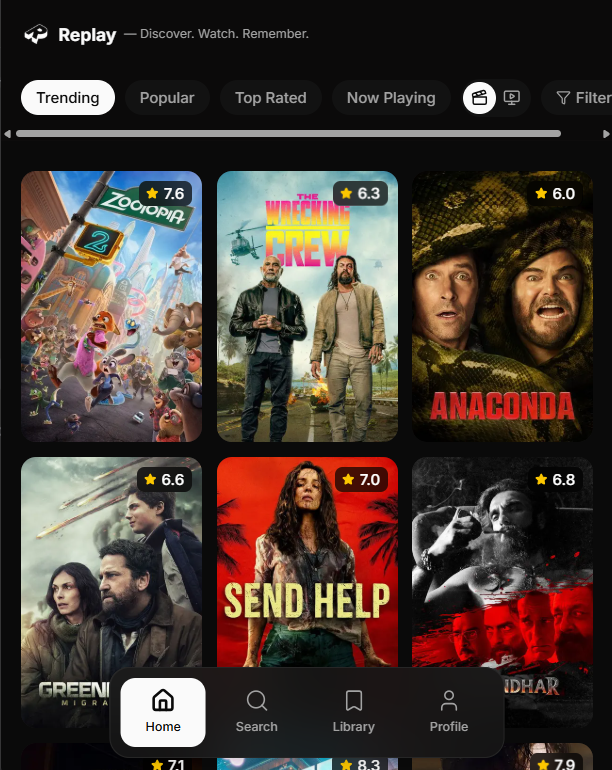
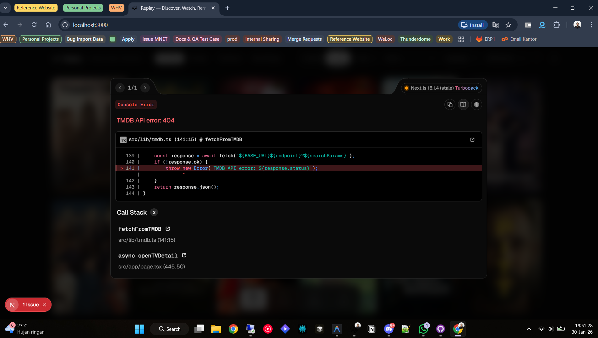
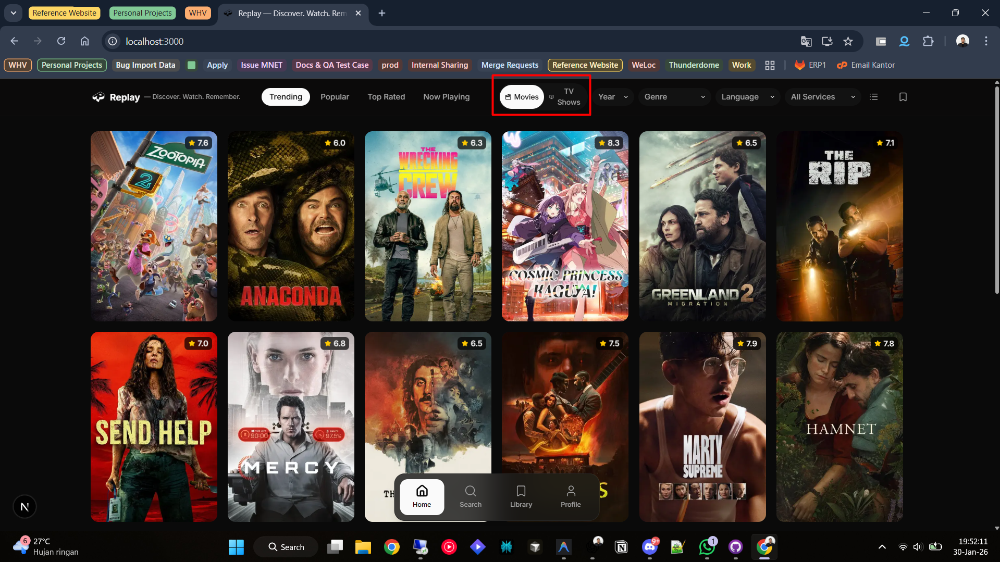
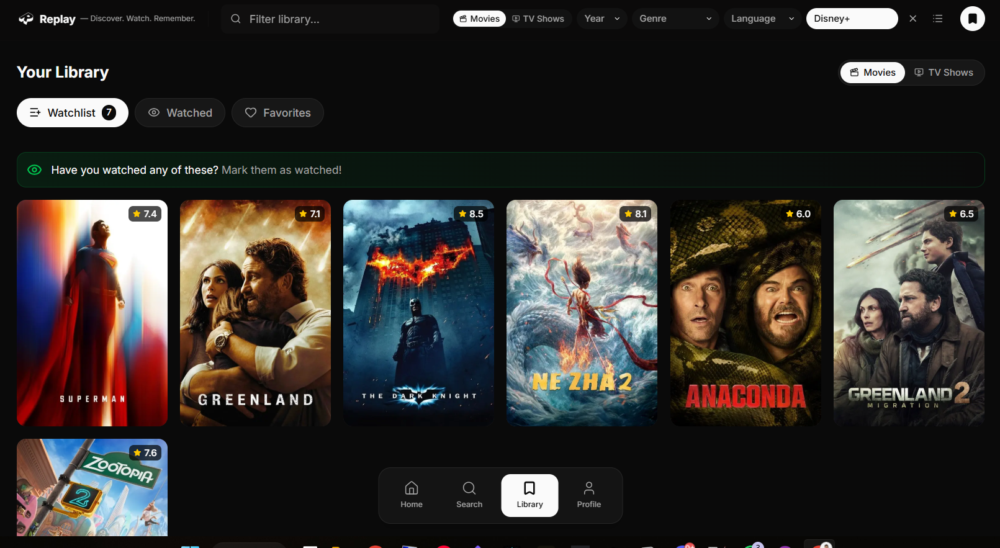

# REPLAY App - UI/UX Fixes & Enhancements

## Overview
This plan outlines 4 critical fixes for the REPLAY movie/TV tracking PWA. Each task includes reference images, expected behavior, and acceptance criteria.

---

## Task 1: Optimize Profile Section Layout

**Current Issue:**  

**Problem:**  
The Profile section requires excessive scrolling to view all information (stats, About section, and storage info). This creates poor UX, especially on mobile devices.

**Requirements:**
- Redesign the Profile section to display all content in a single viewport (no scrolling needed)
- Optimize vertical spacing and component sizing
- Ensure responsive design works perfectly on mobile (320px - 768px widths)
- Maintain visual hierarchy: Logo → Stats → About → Storage Info

**Files to Modify:**
- Likely `src/app/profile/*` or similar profile component files
- Check mobile responsive breakpoints in CSS/Tailwind

**Acceptance Criteria:**
- [ ] All profile content visible without scrolling on desktop (1920x1080)
- [ ] All profile content visible without scrolling on mobile (375x667 - iPhone SE)
- [ ] Visual design remains clean and aesthetically pleasing
- [ ] Spacing is balanced and not cramped

---

## Task 2: Fix TMDB API Error

**Current Issue:**  

**Problem:**  
TMDB API returning 404 error: `https://api.themoviedb.org/3/movie/Portal:[object Object]/watch/providers`

**Root Cause:**
The API request is malformed - `Portal:[object Object]` suggests an object is being stringified incorrectly instead of extracting the movie ID.

**Requirements:**
- Debug the watch providers API call
- Ensure movie ID is properly extracted before making the API request
- Add proper error handling to prevent app crashes
- Verify the correct TMDB API endpoint format: `/3/movie/{movie_id}/watch/providers`

**Files to Investigate:**
- Search for `watch/providers` API calls in the codebase
- Check movie detail modal or streaming provider logic
- Look for object-to-string conversion issues

**Acceptance Criteria:**
- [ ] No 404 errors in console
- [ ] Watch providers load correctly in movie details
- [ ] Proper error handling displays user-friendly message if providers unavailable
- [ ] Code uses correct movie ID extraction (likely `movie.id` not entire object)

---

## Task 3: Fix Media Type Filter Button Layout

**Current Issue:**  

**Problem:**  
The "Movies" and "TV Shows" filter buttons are wrapping onto multiple lines instead of displaying in a single row.

**Requirements:**
- Ensure both buttons display on the same horizontal row
- Maintain proper spacing between buttons
- Ensure responsive behavior (stack vertically only if necessary on very small screens)
- Keep consistent button styling and alignment

**Files to Modify:**
- Header component where media type filters are rendered
- CSS/Tailwind styling for filter button container

**Solution Approach:**
- Use flexbox with `flex-row` and `flex-nowrap` or `whitespace-nowrap`
- Adjust button container width constraints
- Ensure parent container has sufficient width

**Acceptance Criteria:**
- [ ] "Movies" and "TV Shows" buttons display on a single row on desktop
- [ ] Buttons have consistent sizing and spacing
- [ ] Layout is responsive and doesn't break on tablet/mobile
- [ ] Visual alignment matches the overall header design

---

## Task 4: Fix Library Tab Media Type Filter Functionality

**Current Issue:**  

**Problem:**  
The Movies/TV Shows filter in the Library tab is non-functional. Clicking the filter doesn't change the displayed content.

**Requirements:**
- Implement working filter logic to toggle between Movies and TV Shows
- Ensure filter state persists when switching between Watchlist/Watched/Favorites
- Update UI immediately when filter is toggled
- Display appropriate empty state if no items match the filter

**Files to Modify:**
- Library tab component
- Filter state management (useState/context)
- Data filtering logic

**Implementation Steps:**
1. Add state to track selected media type (movies/tv)
2. Filter the library data based on media type selection
3. Update the UI to reflect the active filter
4. Ensure the filter works across all three library sections (Watchlist, Watched, Favorites)

**Acceptance Criteria:**
- [ ] Clicking "Movies" shows only movies in the library
- [ ] Clicking "TV Shows" shows only TV shows in the library
- [ ] Filter state is visually indicated (active button styling)
- [ ] Filter works correctly in Watchlist, Watched, and Favorites tabs
- [ ] Empty state displays if no items match the filter
- [ ] Filter state resets appropriately when navigating away and back

---

## Notes for Claude Opus

**Project Context:**
- This is a Next.js PWA for tracking movies and TV shows
- Uses TMDB API for movie/TV data
- Has bottom navigation: Home, Search, Library, Profile
- Stores user data in localStorage

**Development Server:**
- Already running at `npm run dev`
- Check `c:\Users\Asus\Desktop\project_replay` for project root

**Testing Requirements:**
After implementation, verify:
1. Desktop view (1920x1080)
2. Mobile view (375x667)
3. No console errors
4. All filter interactions work smoothly

**Priority Order:**
1. Task 2 (Critical bug - breaks functionality)
2. Task 4 (Major UX issue - feature not working)
3. Task 1 (UX improvement)
4. Task 3 (Minor visual issue)